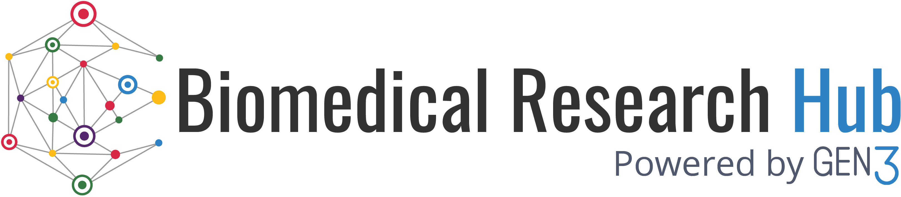

# **Biomedical Research Hub Documentation**

[{: style="height:100px"}](https://brh.data-commons.org/)

The [**Biomedical Research Hub (BRH)**](https://brh.data-commons.org/) is a cloud-based and multifunctional web interface that provides a secure environment for discovery and analysis of scientific results and data. It is designed to serve users with a variety of objectives, backgrounds, and specialties.

The BRH represents a dynamic Data Ecosystem that aggregates and hosts metadata from multiple resources to make data discovery and access easy for users.

The platform provides a way to **search and query** over study metadata and diverse data types, generated by different projects and organizations, and stored across multiple secure repositories.

The BRH also offers a secure and cost-effective cloud-computing environment for data analysis, empowering collaborative research and development of new analytical tools. New workflows and results of analyses can be shared with the community.

The BRH is powered by the open-source software [“Gen3”](https://ctds.uchicago.edu/gen3).

[{: style="height:50px"}](https://ctds.uchicago.edu/gen3)

>Gen3 was created by and is actively developed at the 
>University of Chicago’s Center for Translational Data Science (CTDS)
>with the aim of creating interoperable cloud-based
>data resources for the scientific research community.