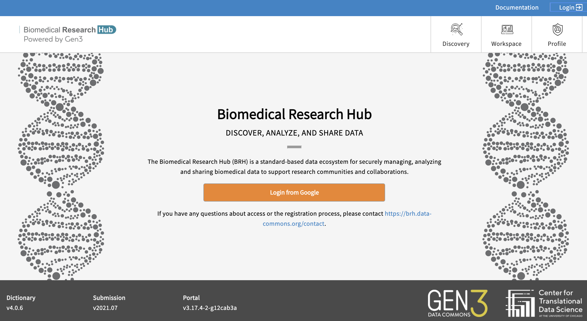

# **Login Page**

[{: style="height:300px"}](https://brh.data-commons.org/login)

Users have two available paths for logging in.

1. *Login from Google:* You may login using any Google account credentials, or a G-suite enabled institutional email. This option may or may not be available depending on the institution or organization the user is associated with.

2. *Login via InCommons --> NIH eRA:* When selecting the NIH/eRA (electronic Research Administration) login using InCommons, you will need access permissions through the [eRA Commons account](https://www.era.nih.gov/).

After successfully logging in, your username will appear in the upper right-hand corner of the page.