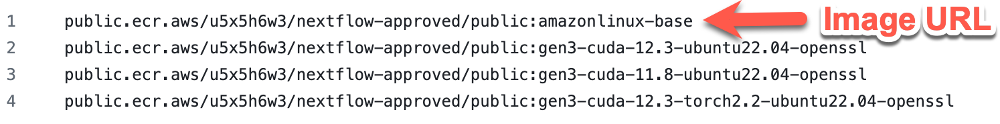
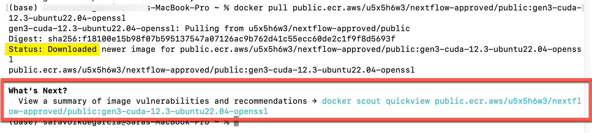
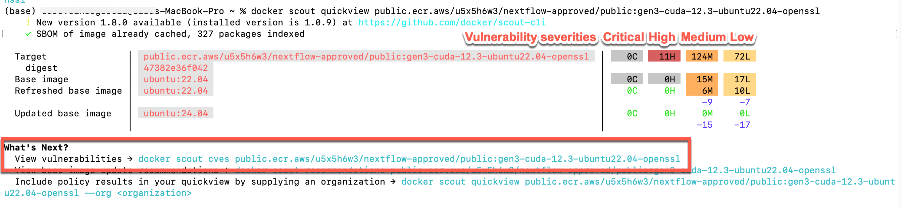

[{: style="height:75px"}](https://www.nextflow.io/)

# **Create a Dockerfile**

### **Overview**

This guide is for users who want to build Docker containers for use in Gen3 workspaces.

### **Prerequisites**

- [Docker Desktop](https://www.docker.com/get-started/) installed on your local machine *(note: Docker Desktop comes with Docker Scout, which will allow you to do your own preliminary security scanning before requesting credentials, so as to save you time. Strictly speaking, only the Docker CLI is required if you are willing to risk uploading without scanning.)*
- Docker Scout *(comes with Docker Desktop)* - required for scanning your built image before requesting credentials
- Create a Docker account - also required for scanning your built image before requesting credentials *(when you sign in on Docker Desktop for the first time, you will be asked to create an account)*
- Clone or download the [`bio-nextflow` repo](https://github.com/uc-cdis/bio-nextflow/tree/master)

## **Start with a security-validated base image**

Gen3 offers a collection of FedRAMP security-compliant base images. We re-assess these base images regularly for security compliance. Building on these base images makes it easier for your customized Docker image to pass the security scanning.

You can access the URLs to pull these images using Docker here:

[https://github.com/uc-cdis/containers/blob/master/nextflow-base-images/allowed_base_images.txt](https://github.com/uc-cdis/containers/blob/master/nextflow-base-images/allowed_base_images.txt)

Please note: if you see **an asterisk next to one of these URLs, it means that the image is temporarily unavailable** because we are resolving a vulnerability in our base image. Please wait until the asterisk is removed to build an image on that base image. If you would like an estimated timeframe for when the base image will be available, please ping us on Slack (`@nextflow-support`).  

### **How to choose your base image**

**GPU vs. CPU**

*Not sure what these are? [Here's a nice overview.](https://blogs.nvidia.com/blog/whats-the-difference-between-a-cpu-and-a-gpu/)*

In our BRH Workspace, we offer workspace images for CPU and GPU tools. You can read more about this on our [Getting Started page](nextflow-getting-started.md/#gpu-vs-cpu-nextflow-workspace-images). Choose the appropriate workspace image (CPU or GPU) for your Docker image and tools.

**GPU images**

**Note for May 2024 MIDRC testers: please be sure to choose the image using CUDA 11.8; even though it is described as "less preferred", it is the version that is compatible with the other tools you're using.**

We have 3 base images in our current selection that offer [CUDA](https://www.turing.com/kb/understanding-nvidia-cuda) support for running on GPUs -- these have "cuda" in the image name, followed by the CUDA version. When possible, please choose the latest version of CUDA compatible with your tools.

> gen3-cuda-12.3-ubuntu22.04-openssl *(preferred)*
>
> gen3-cuda-12.3-torch2.2-ubuntu22.04-openssl *(also preferred)*
>
> gen3-cuda-11.8-ubuntu22.04-openssl *(only use if your tools require a lower version of CUDA)*

**CPU images**

We have one base image that is available for running workflows on CPUs.

> amazonlinux-base

## Verify that your Docker and Docker Scout are working as expected

Before you take the time to build your own Dockerfile, its good to be sure your Docker is able to pull the base image of interest and that you are able to scan with Docker Scout. Doing these tests will be quite quick, and will help you identify problems more easily than if you try to troubleshoot problems in a build.

### **Test pulling the Docker image**

This will help make sure you can pull the base image of interest by running the `docker pull` commmand in your terminal, as described below.

First, open your Docker Desktop application (just to be sure Docker is running).

Next, open your terminal. Run `docker pull <image URL>`, where the image URL is the full line as displayed in the [file of security-validated base images](https://github.com/uc-cdis/containers/blob/master/nextflow-base-images/allowed_base_images.txt). If it's working, you will see language that it is pulling (see below). When it's complete (and successfully pulled), there will be a line that says `Status: Downloaded <image>` (see yellow highlight below). If you see this, you know that all the steps necessary to pull your image work. If you don't see this, reach out to us on Slack (`@nextflow-support`)

### **Test using Docker Scout to evaluate image vulnerabilities**

At the end of your test pull, Docker offers a suggestion to use Docker Scout to examine your image for vulnerabilities (see red box above). Since you will want to use Docker Scout to evaluate your custom build later, now is a convenient time to test this tool and make sure you are fully set up to run Docker Scout (even though we do not expect the base images to have any security problems).  

*Note: If you don't seem to have access to Docker Scout, check whether you're using the [latest Docker version](#prerequisites).*

#### **Run Docker Scout**

To run Docker Scout, you must:

* have Docker running (for example, the desktop application open)
* be signed in to Docker (in the desktop application, there is a Sign In button in the upper right corner)
* have created a Docker account (when you sign in for the first time, you will be asked to create an account).

Once you are signed in to Docker, you can run the command they suggest after pulling an image (for example, see the command in blue text in the red box above, `docker scout quickview <image URL>`). If the command runs successfully, you should see output similar to the screenshot below. This is a summary of the vulnerabilities in your image.

You can run the next suggested command (shown in red box above, `docker scout cves...`) to see the full list of vulnerabilities.

**Images should be able to pass Gen3 security scanning if there are no Critical vulnerabilities.**  

*But please note: The unfortunate nature of vulnerabilities is that there are always new ones appearing, despite our active monitoring. If you do see that one of our base images has a Critical vulnerability reported by Docker Scout, please alert us on Slack (`@nextflow-support`)*

*Want to know more about Docker Scout? [Check out the documentation](https://docs.docker.com/scout/quickstart/).*

## **Build your image locally on top of the base image**

To build your own image, you need to create a Dockerfile. *(Reminder: Dockerfiles are typically named just "Dockerfile" - with a capital D and no file extension.)* To build your image on a base image, the first line of the Dockerfile should reference the base image tag. The Dockerfile you create typically lives in the Git repository where you have your code to make it easier to copy into your container.  

**Important note: Users on Macs with an M1 or M2 chip** MUST build the Docker image using a platform flag so it can be run in Batch. *(If you are not using an M1/M2 chip, you can also use this command, although you do not have to if you prefer a more typical build command.)* This command will set the appropriate target platform for `build` so your image can be used in Batch:  

`docker buildx build --pull --platform linux/amd64 .`

*(note the `.` at the end of the command)*

*The `--pull` part of the command will ensure you are always pulling a fresh version of the base image, and not using any cached images from previous builds that may now have vulnerabilities.*

*You can read more about this platform flag and building for a platform [here](https://docs.docker.com/reference/cli/docker/buildx/build/#platform) and [here](https://docs.docker.com/build/building/multi-platform/).*

### **Unfamiliar with creating Dockerfiles?**

If you are unfamiliar with creating Dockerfiles, we encourage you to explore the [excellent tutorial here](https://medium.com/@anshita.bhasin/a-step-by-step-guide-to-create-dockerfile-9e3744d38d11), as well as review the [Dockerfile documentation here](https://docs.docker.com/develop/develop-images/dockerfile_best-practices/), before you proceed.  

Note: Dockerfiles are typically named just "Dockerfile" - with a capital D and no file extension.

### **Example: Build an image with a Dockerfile and a requirements.txt**

*Please note: Images built on any of the base images with CUDA can take 3 hours or more to completely build.*  

In our example here, we will have you build your image using a `requirements.txt` to identify the software tools you want to add to the base image, as well as a Dockerfile that pulls in the base image, adds the software tools specified in the requirements file, copies relevant code files, and establishes some setup parameters.

Our example will use the files in the [torch_cuda_test directory](https://github.com/uc-cdis/bio-nextflow/tree/master/nextflow_notebooks/containerized_gpu_workflows/torch_cuda_test) of the bio-nextflow repository. You can review the `readme` file in this directory for more information. It is a simple example that will build up from our base image by adding PyTorch. The Nextflow script will ultimately use a Python script that checks the version of CUDA in the GPU instance and checks whether it is compatible with the version of PyTorch and CUDA available in the container.

First, in the terminal, navigate to the directory where you cloned the the `bio-nextflow` repository (see [Prerequisites section](#prerequisites)). Next, navigate to where the downloaded Dockerfile and requirements.txt are located:

`cd bio-nextflow/nextflow_notebooks/containerized_gpu_workflows/torch_cuda_test`

> If you open the Dockerfile, note that the first line of the Dockerfile references the URL for one of our GPU base images. This is always how you will reference a base image -- with `FROM` and the URL.

Then, run the Docker `build` command. For example:

`docker buildx build --pull --platform linux/amd64 . -t my_docker`  

will tag the Dockerfile in the local directory with the tag `my_docker`, and build a Docker image using the Dockerfile.  

### **Example: Examine built image for vulnerabilities**

You now have a new Docker image built upon our security-compliant base image. To identify and address any security concerns in your customized image before submitting for upload, we encourage all users to locally scan their image for vulnerabilities using Docker Scout, as described [in our test above](#test-using-docker-scout-to-evaluate-image-vulnerabilities). Here, we have tagged our new image with `my_docker`. So, we would run the Docker Scout `quickview` command on the image using this command:

`docker scout quickview my_docker`

And to identify the specific vulnerabilities and recommendations, you would run:

`docker scout cves my_docker`

### **My image passes the local security scanning**

Once your custom image is security-compliant based on the analysis from Docker Scout, you are ready to request credentials to submit your Docker image for Gen3 security scanning.  

Local security scanning of your built images is highly recommended for the most efficient path to having your image available for use in Nextflow workflows. However, it is not absolutely required; you can submit images without first scanning them with Docker Scout. If you do not do local scanning, there is a higher chance that you will have to submit your custom-built images more than once.  

[*Continue to Request Credentials*](./nextflow-request-creds.md)
