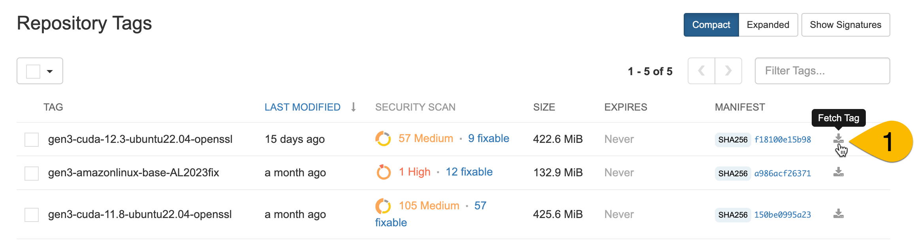
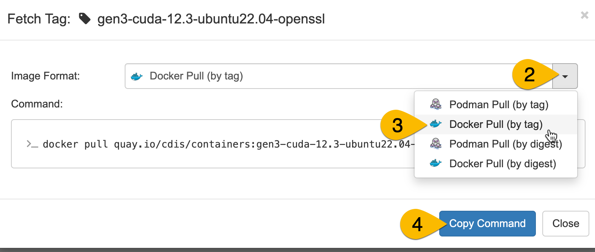
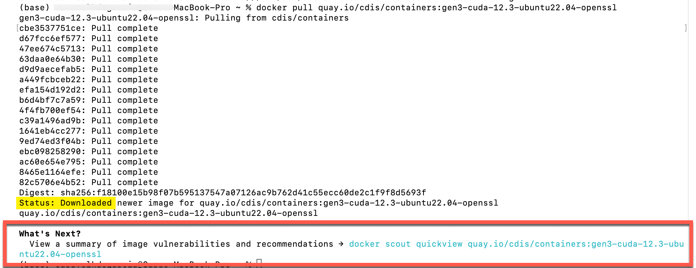

[{: style="height:75px"}](https://www.nextflow.io/)

# **Create a Dockerfile**

### Overview

This guide is for users who want to build Docker containers for use in Gen3 workspaces.

### Prerequisites

- [Docker](https://www.docker.com/get-started/) installed on your local machine
- Clone or download the [`bio-nextflow` repo](https://github.com/uc-cdis/bio-nextflow/tree/master)

## Start with a security-validated base image

Gen3 offers a collection of FedRAMP security-compliant base images. Building on these base images makes it easier for your customized Docker image to pass the security scanning.

You can access these images on on Quay.io, a repository site for Docker images:

[https://quay.io/repository/cdis/containers?tab=tags&tag=latest](https://quay.io/repository/cdis/containers?tab=tags&tag=latest)

### How to choose your base image

**GPU vs. CPU**

*Not sure what these are? [Here's a nice overview.](https://blogs.nvidia.com/blog/whats-the-difference-between-a-cpu-and-a-gpu/)*

Some tools you may be using in your workflow can take advantage of GPU capacity for parallel processing. If so - use one of our GPU images. If your workflow is not designed for GPU, use our CPU image.

**GPU images**

We have 2 images in our current selection that offer [CUDA](https://www.turing.com/kb/understanding-nvidia-cuda) support for running on GPUs -- these have "cuda" in the image name, followed by the CUDA version. When possible, please choose the latest version of CUDA compatible with your tools.

> gen3-cuda-12.3-ubuntu22.04-openssl *(preferred)*
> gen3-cuda-11.8-ubuntu22.04-openssl *(only use if your tools require a lower version of CUDA)*

**CPU images**

We have one image that is available for running workflows on CPUs.

> gen3-amazonlinux-base-AL2023fix

### Fetch the tag to pull the Docker image

To get a command that will pull your desired Docker image for use in your Dockerfile, click on the Fetch Tag button (labeled #1 above). This will open a pop-up window:

Click on the dropdown for image format (#2), then select `Docker pull (by tag)` (#3). Click the "Copy Command" button to copy the command to fetch this Docker image. This command will be the first line in your Dockerfile.

### Test the fetch command

Before you proceed with this command in your Dockerfile, you want to make sure you can pull the image. You can verify this by running the fetch tag commmand in your terminal while Docker is running.

First, open your Docker Desktop application (just to be sure Docker is running).

Next, open your terminal. Paste the fetch tag command you copied from Quay. If it's working, you will see language that it is pulling (see below). When it's complete (and successfully pulled), there will be a line that says `Status: Downloaded <image>` (see yellow highlight below). If you see this, you know that all the steps necessary to pull your image work. If you don't see this, reach out to us on Slack.

### Test using Docker Scout to evaluate image vulnerabilities

At the end of your test fetch, Docker offers a suggestion to use Docker Scout to examine your image for vulnerabilities (see red box above). We have already evaluated the security compliance for our image, so it's not necessary here. However, since you will want to use Docker Scout to evaluate your custom build later, now is a convenient time to test this tool and make sure you are fully set up to run Docker Scout.

#### Run Docker Scout

To run Docker Scout, you must:

* have Docker running (for example, the desktop application open)
* be signed in to Docker (in the desktop application, there is a Sign In button in the upper right corner)
* have created a Docker account (when you sign in for the first time, you will be asked to create an account).

Once you are signed in to Docker, you can run the command they suggest after pulling an image (for example, see the command in blue text in the red box above, `docker scout quickview...`). If the command runs successfully, you should see output similar to the screenshot below. This is a summary of the vulnerabilities in your image.

You can run the next suggested command (shown in red box above, `docker scout cves...`) to see the full list of vulnerabilities.

Images will be able to pass Gen3 security scanning if there are no Critical or High vulnerabilities, and **[add something about CVSS?]**

*Want to know more about Docker Scout? [Check out the documentation](https://docs.docker.com/scout/quickstart/).*

## Build your image locally on top of the base image

To build your own image, you need to create a Dockerfile. To build your image on a base image, the first line of the Dockerfile should reference the base image tag. The Dockerfile you create typically lives in the Git repository where you have your code to make it easier to copy into your container.

### Unfamiliar with creating Dockerfiles?

If you are unfamiliar with creating Dockerfiles, we encourage you to explore the [excellent tutorial here](https://medium.com/@anshita.bhasin/a-step-by-step-guide-to-create-dockerfile-9e3744d38d11), as well as review the [Dockerfile documentation here](https://docs.docker.com/develop/develop-images/dockerfile_best-practices/), before you proceed. We have identified only key highlights below.

One reminder: Dockerfiles are typically named just "Dockerfile" - with a capital D and no file extension.

### Example: Build an image with a Dockerfile and a requirements.txt

In our example here, we will have you build your image using a `requirements.txt` to identify the software tools you want to add to the base image, as well as a Dockerfile that pulls in the base image, adds the software tools specified in the requirements file, copies relevant code files, and establishes some setup parameters.

Our example will use the files in the [torch_cuda_test directory](https://github.com/uc-cdis/bio-nextflow/tree/master/nextflow_notebooks/containerized_gpu_workflows/torch_cuda_test) of the bio-nextflow repository. You can review the `readme` file in this directory for more information. It is a simple example that will build up from our base image by adding PyTorch. The Nextflow script will ultimately use a python script that checks the version of CUDA in the GPU instance and checks whether it is compatible with the version of PyTorch and CUDA available in the container.

First, in the terminal, navigate to the directory where the downloaded Dockerfile and requirements.txt are located.

> Note that the first line of the Dockerfile references the fetch tag for one of our GPU base images. This is always how you will reference a base image -- with `FROM` and the Dockertag.

Then, run the Docker `build` command. For example:

`docker build . -t my_docker`

will tag the Dockerfile in the directory with the tag `my_docker`, and build a Docker image using the Dockerfile.

### Example: Examine built image for vulnerabilities

You now have a new Docker image built upon our security-compliant base image. To more rapidly identify and address any security concerns in your customized image, we encourage all users to locally scan their image for vulnerabilities using Docker Scout, as described [in our test above](#test-using-docker-scout-to-evaluate-image-vulnerabilities). Here, we have tagged our new image with `my_docker`. So, we would run the Docker Scout `quickview` command on the image using this command:

`docker scout quickview my_docker`

And to identify the specific vulnerabilities and recommendations, you would run:

`docker scout cves my_docker`

### My image passes the local security scanning

Once your custom image is security-compliant based on the analysis from Docker Scout, you are ready to submit your Docker image for Gen3 security scanning.

[*Continue to Request Credentials*](./nextflow-request-creds.md)
