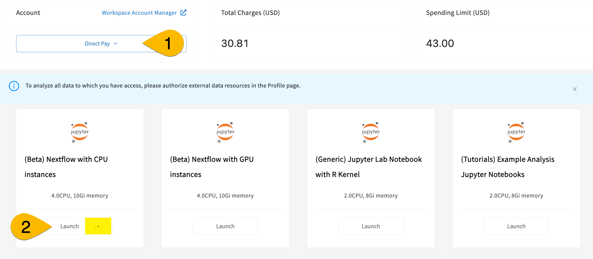

[{: style="height:75px"}](https://www.nextflow.io/)

# **Getting started with workflows on Gen3**

[{: style="height:75px"}](https://gen3.org/)

*Please note: Nextflow features are only available to users with a Direct Pay workspace account. [See our documentation for persistent paymodels](13-workspace_accounts.md) to learn more about getting a Direct Pay workspace account.*

## **Background**

### *What is Gen3?*

The Gen3 platform consists of open-source software services that make up data commons and data ecosystems (also called meshes or fabrics). A data commons is a platform that co-locates both data and compute resources so researchers can bring algorithms to the data. Data ecosystems or meshes are systems that researchers can use to search and query across multiple data commons in one location.

More information about Gen3 can be found [here](https://gen3.org/). A list of data platforms using the Gen3 technology can be found [here](https://stats.gen3.org/).

### *What are workflows?*

A workflow is a computational pipeline that consists of a series of steps to be executed. It could run using a software container that is a standalone, self-contained piece of software containing all the executables needed for the workflow.

Many workflow languages have been developed in recent years. Common examples include [Common Workflow Language (CWL)](https://www.commonwl.org/), [Open Workflow Description Language (WDL)](https://openwdl.org/), and [Nextflow](https://www.nextflow.io/). We will be using Nextflow for our exercises.

### *Workflow execution in Gen3*

Gen3 is based on kubernetes and is container-based. A container is a standalone, self-contained collection of software that contains specific software you may need for your application (e.g., Pydicom/DICOM, Numpy, SciPy). We are testing a new workflow execution system in Gen3 that researchers can use to run containers on the cloud for various applications in a secure and isolated manner. We developed an isolation process so that each user’s workflow is separate from each other, from the Gen3 core system, and from Gen3 data, except when approved and required for the specific task. The testing and development of workflows is currently underway in the [Biomedical Research Hub (BRH)](https://brh.data-commons.org/), one of the first data ecosystems (or meshes) built at CTDS.

### *What is Nextflow? What is AWS Batch?*

The workflow execution in Gen3 is powered using [Nextflow](https://www.nextflow.io/), a framework for writing data-driven computational pipelines using software containers. It is a very popular and convenient framework for specifying containers, inputs and outputs, and running jobs on the cloud. Researchers have used Nextflow for several years, and 2023 has continued to see a rapid gain in its popularity per a [recent survey](https://seqera.io/blog/the-state-of-the-workflow-2023-community-survey-results/). The scalability of workflows in Gen3 comes from [AWS Batch](https://docs.aws.amazon.com/batch/latest/userguide/what-is-batch.html), an AWS service capable of running compute jobs over large datasets on the Cloud.

## **Steps to run workflows in Gen3**

To run workflows in Gen3, you will need the following:

* Access to the BRH workspace (covered on this page)
* A funded workspace account (covered on this page)
* A Docker image uploaded to an ECR created for you (start with [Create Dockerfile](./nextflow-create-docker.md))

*Depending on your specific workflows, you may also need additional tools, resources, or access.*

### **Get access to the BRH workspace and set up a funded account**

#### 1) Request access to the BRH workspace

The BRH exposes a [computational workspace](https://brh.data-commons.org/workspace) that researchers can use to run simple Jupyter notebooks and submit workflows. To submit workflow jobs, you need access to the BRH workspace.

Follow [these instructions](https://uc-cdis.github.io/BRH-documentation/05-workspace_registration/#requesting-temporary-trial-access-to-brh-workspace) to request trial access to the BRH workspace.  After you have submitted your request, please ping `@Sara Volk de Garcia` in Slack to alert her to look for your request and approve it.

#### 2) Establish a workspace account with a persistent pay model in BRH

When you initially are granted workspace access in BRH, it is a trial access that is free for the user (paid by CTDS). However, the trial access paymodel does not permit access to the Nextflow image. To gain access to the Nextflow image needed for testing, you must request a workspace account with a persistent paymodel, so that the cost of compute jobs in your project can accrue to the right account. BRH currently supports several persistent pay models such as NIH STRIDES (payment through grant funds) and Direct Pay (credit card payment). If you're curious, [see here](https://uc-cdis.github.io/BRH-documentation/13-workspace_accounts/) for more information about pay models.

For MIDRC, we have already established a Direct-Pay-type* of workspace account for testing. When you receive workspace access, Sara will work with the Nextflow team to add a Direct Pay account to your workspace.

*\* Note about this Direct-Pay-type of account: It is not an ACTUAL Direct Pay account, and it does not go through the normal Direct Pay account route, nor through OCC, at all. It is funded with MIDRC contract funds, but will be labeled Direct Pay in your workspace.*

### **3) Launch a workspace with the persistent paymodel**

Once you have been notified that you have a workspace account provisioned with persistent paymodel funds, you can proceed.

* Log in to BRH and open the workspace page.
* In the dropdown under "Account" in top left, select "Direct Pay" as your paymodel (#1 in screenshot below).
* Once you select the Direct Pay workspace account, you should see a new option for workspace image: "(Beta) Nextflow with CPU instances"
* Click the Launch button for this Nextflow workspace image (#2).
* When you click the button, the workspace will begin to launch. This can take 5-10 minutes. You will know you successfully started the launch because you will see 3 animated dots rippling in the Launch button (see yellow highlight).
> *If it takes longer than 10 minutes, try refreshing the screen and re-trying the launch. If it seems to stall out (longer than 10 min again), or if you get an error, reach out to CTDS staff through the Slack channel (but don't close the tab with the launch).*

### **Quick orientation to the the workspace**

Before using the workspace, we strongly encourage you to [review the BRH Workspace documentation](https://uc-cdis.github.io/BRH-documentation/09-workspace_page/#guideline-to-get-started-in-workspaces).

There are several key points we want you to be aware of:

#### Store all data in the persistent directory (/pd)

Store all files you want to keep after the workspace closes in the `/pd` directory; **only files saved in the /pd directory will persist**. Any personal files in the folder `data` will be lost.

{: style="height:400px"}

#### Automated shutdown for idle workspaces

Workspaces will automatically be shut down (and all workflows terminated) after **90 minutes of idle time**.

#### GPU vs CPU Nextflow workspace images

As you can see [in the screenshot above](#3-launch-a-workspace-with-the-persistent-paymodel), there are 2 Nextflow workspace images: A CPU image and a GPU image. If your workflow requires GPU (e.g., deep learning or other AI/ML models), please use the GPU instance; otherwise, use CPU. You can [read more about CPU and GPU options in Gen3 Nextflow here](nextflow-create-docker.md/#how-to-choose-your-base-image).  

[*Continue to Overview of Containers in Gen3*](./nextflow-overview-containers.md)
