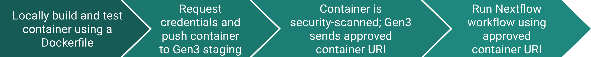

[{: style="height:75px"}](https://www.nextflow.io/)

# **Overview: Developing and Deploying Containers in Gen3**

**Locally build and test container:**
Gen3 provides several FedRAMP security-compliant base images that users can pull and customize.

**Request credentials and push container to Gen3 staging:**
Users can email Gen3 to request short-term credentials that permit them to authenticate Docker in their terminal to upload the local image to Gen3 staging for security review.

**Container is security-scanned; Gen3 sends approved container URI:**
Gen3 completes the security scan within minutes. If it is compliant, the image is moved to an ECR repo from where the container can be run, and Gen3 staff will send a container URI. If there are problems, a report of the vulnerabilities is provided for remediation and resubmission.

**Run workflow using approved container URI:**
In the BRH workspace, use a Nextflow Jupyter notebook to run Nextflow workflows in the approved container using the approved container URI.

---
[*Continue to Create Dockerfile*](./nextflow-create-docker.md)
