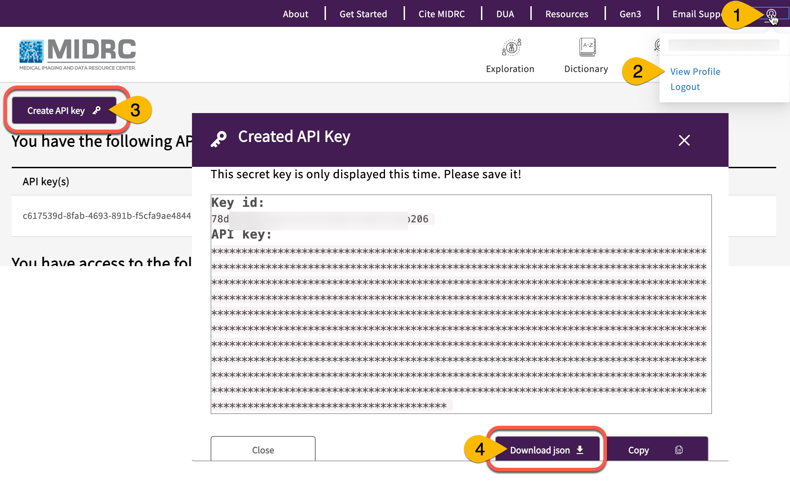

[{: style="height:75px"}](https://www.nextflow.io/)

# **Tutorial Nextflow Workflows**

Work in progress - working from [this document](https://docs.google.com/document/d/1GV9xR56I_9_QyuARs8RZzxKK3duw_bC038XMNr0YImo/edit?usp=sharing_0)

## Get set: Download necessary credentials and software

Be ready to execute the tutorial workflows below by gathering credentials and installing necessary software.

### **MIDRC credentials**

You need to generate a MIDRC credentials on the profile page of the [MIDRC portal](https://data.midrc.org/) to download GUIDs in the workspace. For this, please go to [data.midrc.org](https://data.midrc.org/), click on the user icon in the right corner (#1), and open the Profile page (#2). Click on Create API Key (#3). A pop-up window will appear with the key. If you scroll down slightly, you can see the button to download the credentials as a JSON. Credentials are valid for 1 month.

### Get and replace placeholder values in the Nextflow config

Once you have launched the nextflow workspace for the first time, please ping @Sai or @Ao on Slack so they can give you the values to replace the placeholders in the`queue`, `jobRole` and `workDir` fields in the [midrc_batch_cpu_demo notebook](https://github.com/uc-cdis/bio-nextflow/blob/feature/gpu_test/nextflow_notebooks/midrc_demo_notebooks/midrc_batch_cpu_demo.ipynb). For now, these placeholder values will need to be replaced manually, but we are working on pre-populating these values in our configs.

## Tutorial 1: Test running Nextflow and AWS Batch workflow in existing Docker container to get MIDRC image files, convert them to PNG, and extract the metadata

Please see code snippet below that shows an example of how to run two basic processes on DICOM files on AWS Batch: i) convert to PNG, ii) extract metadata. Note that to run this, you need to first download open-access DICOM files first to your workspace using the Gen3 SDK (PART 1), and you can stage the files on AWS Batch and run the workflow (PART 2)
