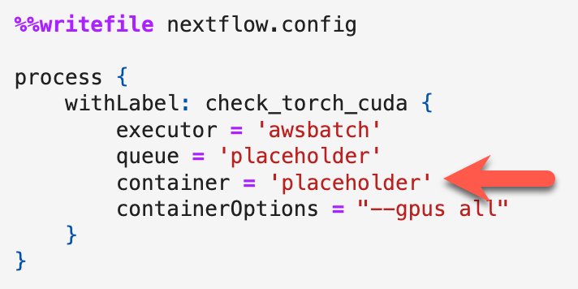

[{: style="height:75px"}](https://www.nextflow.io/)

# **Pushing Docker Images to AWS ECR**

### **Overview**

This guide is for users who have received temporary credentials granting access to push container images to a specific AWS Elastic Container Registry (ECR) repository.

### **Prerequisites**

- [Docker](https://www.docker.com/get-started/) installed on your local machine. *This can be Docker Desktop or the Docker CLI.*  
- [AWS CLI](https://docs.aws.amazon.com/cli/latest/userguide/getting-started-install.html) installed locally
- Temporary AWS credentials provided by the User Services team (see [Request Credentials](nextflow-request-creds.md)).
- The ECR repository URI you have been given access to (at the top of the AWS credentials provided by the support team)
- A built image you want to push (see [Create a Dockerfile](nextflow-create-docker.md))

### **A note about timing**

Your temporary AWS credentials only lasts for 1 hour from when they were created; User Services should have provided an expiration time when sharing the credentials with you. You must start the push to ECR before they expire, or you will need to request new credentials from User Services.

If you do **not** push an image to the ECR before they expire, please ping `nextflow-support` in Slack so we know not to monitor for an image to progress through scanning.

### **A note about security and expiration of approved Docker images**

Because of the ever-updating nature of vulnerability detection, an image that has passed in the past is not guaranteed to always pass. Even if you are resubmitting an image that has passed previously, there may be new vulnerabilities that have been reported that mean the image does not pass now. Best practices for most efficient submission are to always [examine an image with Docker Scout](nextflow-create-docker.md/#run-docker-scout) before pushing it.  

Similarly, because new vulnerabilities are always emerging, to protect the security of the Gen3 Workspace, approved containers will only remain available in the approved repo for 30 days. However, users can always request new credentials and resubmit their image for scanning.

Finally, although we make every effort to regularly scan and monitor our base images to ensure that they are free of all critical vulnerabilities, you may have the misfortune to be the first to find a vulnerability in our base image. If you believe you have identified a critical vulnerability in one of our base images, please ping us on Slack at `nextflow-support`.  

## **Set AWS environment variables:**

*The commands in this section are valid if you are using a Linux or MacOS. If you are using Windows, we will provide a separate set of commands for you to set the AWS environment variables.*

Before you can push your Docker image to the ECR repository, you need to configure the AWS CLI with the temporary credentials you received. In the credentials sent to you, there should be the commands needed to run this below the line "Please run the following commands to set your AWS credentials:". Copy those (they will look similar to the block below) and run them in the terminal.

      export AWS_ACCESS_KEY_ID=<AccessKeyId>
      export AWS_SECRET_ACCESS_KEY=<SecretAccessKey>
      export AWS_SESSION_TOKEN=<SessionToken>

> Note: for Linux or Windows, the variables are set only as long as the terminal is open; export the variables again if you close and open a new terminal.

### **Verify configuration:**

Run `aws sts get-caller-identity` to verify that your CLI is using the temporary credentials. If you successfully set the variables, you should see output showing the AWS information - UserID, account, etc.

### **Authenticate Docker to ECR**

Next, use the AWS CLI to retrieve an authentication token and authenticate your Docker client to your registry. In the credentials, there is a command below the line "After setting credentials you will need to log in to your docker registry. Please run the following command:". Copy that (it will look similar to the command below) and run it in the terminal.

     aws ecr get-login-password --region <region> | docker login --username AWS --password-stdin <repositoryUri>

## **Preparing to push your Docker image: Tag your Docker image**

You should already have a [locally-built Docker image](nextflow-create-docker.md) before you get your credentials. But, you do need to tag it with the ECR repository URI and the image tag you want to use.  

     docker tag <local-image>:<local-tag> <repositoryUri>:<image-tag>

Replace `< local-image >` with the name of your local Docker image and `< local-tag >` with the tag you want to push.
> If you're not sure what your local image and tag names are, you can run `docker images` in your terminal. It will provide a list of all your saved docker images. The column called `REPOSITORY` is the local image name. The column called `TAG` is the local tag name for this image.  
> Note: the `image-tag` you select will travel with your image to the approved repo. So, select a tag you are comfortable with.

Replace `< repositoryUri >` with the ECR repository URI provided at the top of the credentials file, and `< image-tag >` with the image tag name you want to use in your ECR.
> Important note: If you do not want the most-recently-pushed image to replace an earlier version with the same tag in your ECR, image-tags should be unique.  
> For example, you create an image with an image-tag `batch-poc`. If you later push another image to `< repositoryUri >:batch-poc`, it will overwrite the previous version of the image in your ECR (you will only have 1 container with the image tag "batch-poc").  
> If you do not want to overwrite, you can use versioned image-tags. For example: `batch-poc-1.0`, and then `batch-poc-1.1`.  
> If you want to replace previous versions of your container, you can use the same image-tag.  

## **Push the Docker image to the ECR**

Push the tagged image to the ECR repository. The `docker push` command is also in the credentials - you just need to specify the image tag you selected when either tagging or building the image in the previous section.  

     docker push <repositoryUri>:<image-tag>

If the **push is successful**, you will see various "layer 1" "layer 2" etc outputs, and it will indicate progress in pushing. This can take minutes or longer, depending on how large your container is.  

If the **push fails**, you will get a persistent message about "Waiting for layer". This usually means it cannot find the repository, so double-check that there is no typo, and that you have set your [AWS environment variables](#set-aws-environment-variables) since you opened the terminal most recently.  

### **Completion**

Once the push completes, your Docker image will be available in the ECR repository (although you will not be able to see it). It will be scanned, and if passes the security scanning, CTDS will move it to the nextflow-approved repo. When it's available in nextflow-approved, User Services will reach out by direct message in Slack to share a Docker image URI that looks something like this:  
`< account number >.dkr.ecr.us-east-1.amazonaws.com/nextflow-approved/< your username >:< image-tag >`  
You can then use this image URI (not to be confused with your repository URI) to run Nextflow workflows with your container in the BRH workspace. (Note that you need to copy the whole image URI into the container field of the nextflow notebook, as described [in the next section](#how-to-use-an-approved-docker-image-uri).)

## **How to use an approved Docker Image URI**  

Once you have your Docker image URI, you are ready to run your Nextflow workflow! You can take the Docker image URI (copy the entire line) and make it the value for the "container" field(s) in your Nextflow notebook. For example, in the `torch_cuda_batch` [Nextflow notebook](https://github.com/uc-cdis/bio-nextflow/blob/master/nextflow_notebooks/containerized_gpu_workflows/torch_cuda_test/torch_cuda_batch_template.ipynb), you would go to the `nextflow.config` section and replace the `placeholder` value for `container` with the approved Docker image URI sent by the support team after you [pushed the image for scanning](#push-the-docker-image-to-the-ecr).  

Please note that you will need to replace all `placeholder` values in the `nextflow.config` with values specific to your workspace. Please see the section ["Get and replace placeholder values from the Nextflow config"](nextflow-tutorial-workflows.md/#get-and-replace-placeholder-values-from-the-nextflow-config) on the Tutorials page for more information.

{: style="height:175px"}

## **Support**

If you encounter any issues or require assistance, please reach out to the User Services team on Slack at `nextflow-support` (no `@`), or by email at [brhsupport@gen3.org](mailto:brhsupport@gen3.org). (Slack will result in the quickest reply.)

[*Continue to Tutorial Workflows*](./nextflow-tutorial-workflows.md)
